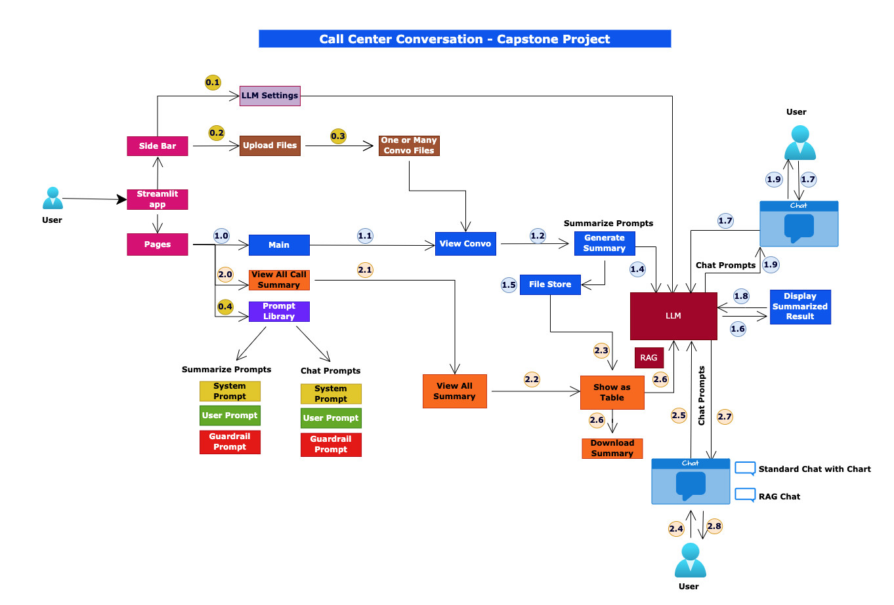

# Call Center AI Summarizer

An AI-powered Streamlit application for bulk call center summarization with intelligent chat analysis and professional data visualization. Process up to 10 call transcripts simultaneously, generate comprehensive summaries, analyze data with interactive charts, and interact with an LLM to extract insights from your call data.

## 📋 Table of Contents

- [Quick Navigation](#-quick-navigation)
- [Features](#-features)
- [Installation & Setup](#-installation--setup)
- [Usage Guide](#-usage-guide)
- [Chart Features](#-chart-features)
- [Technical Specifications](#-technical-specifications)
- [Project Structure](#-project-structure)
- [Configuration](#-configuration)
- [Troubleshooting](#-troubleshooting)

---

## 🗺️ Quick Navigation

| Document | Purpose |
|----------|---------|
| **[QUICK_START.md](QUICK_START.md)** | 30-second setup and first chart generation |
| **[CHART_FEATURES.md](CHART_FEATURES.md)** | Complete guide to all 7 chart types with examples |
| **[QUICK_REFERENCE.md](QUICK_REFERENCE.md)** | Quick lookup for keywords, commands, and troubleshooting |
| **[CHARTING_IMPLEMENTATION.md](CHARTING_IMPLEMENTATION.md)** | Technical implementation details for charting system |
| **[IMPLEMENTATION_COMPLETE.md](IMPLEMENTATION_COMPLETE.md)** | Full technical documentation and architecture |

👉 **New to the project?** Start with [QUICK_START.md](QUICK_START.md)  
👉 **Want to see available charts?** Check [CHART_FEATURES.md](CHART_FEATURES.md)  
👉 **Need quick answers?** Use [QUICK_REFERENCE.md](QUICK_REFERENCE.md)

---

## 🎯 Features

### Core Summarization
- **Bulk Call Summarization**: Process up to 10 call transcripts in a single batch
- **Multi-Model Support**: Choose between GPT-4.1-mini and GPT-4.1-nano models
- **Configurable Parameters**:
  - Temperature control (0.0-1.0) for response consistency
  - Token limits (0-1000) for response length
  - Summary length (1-10 sentences)
- **Flexible Input Methods**:
  - Upload call transcripts (.txt files)
  - Select from pre-loaded conversations in `input_data/` folder
  - Use sample call data for testing
- **Auto-Incrementing ID System**: Automatic ID assignment for bulk summaries with metadata tracking
- **Persistent Storage**: Save summaries to JSON with auto-appending (no data loss)
- **CSV Export**: Download summaries as CSV files

### Functional Flow Diagram




### Chat & Analysis
- **Interactive Chat with Summaries**: Ask questions about all summaries on the "View Summaries" page
- **Full Context Awareness**: LLM has access to complete summary data including:
  - Agent name, ID, and performance scores
  - Customer tone and emotions
  - Call duration and timing
  - Issues identified and resolutions
  - Sentiment analysis and ratings
- **Persistent Chat History**: Chat conversations saved to `output_data/bulk_summary_chat_history.json`
- **Multi-Turn Conversations**: LLM maintains context across multiple exchanges
- **Structured Prompts**: Dedicated system, user, and guardrail prompts for chat interactions
- **Predefined Questions**: 6 quick-action buttons for instant chart generation:
  - 📊 Show agent performance
  - 😊 What's the sentiment distribution?
  - ⭐ What are the agent ratings?
  - ✅ What's the resolution rate?
  - ⏱️ How long are the calls?
  - 🎯 Which agent handled the most calls?

### Prompt Management
- **6 Customizable Prompts** in `prompt_store/`:
  - **Summarization Prompts** (3 files):
    - `summarize_system_prompt.txt` - System instructions for summarization
    - `summarize_user_prompt.txt` - User instructions with JSON output format
    - `summarize_guardrail_prompt.txt` - Safety and quality guidelines
  - **Chat Prompts** (3 files):
    - `chat_system_prompt.txt` - System context for chat analysis
    - `chat_user_prompt.txt` - Chat instructions with structure definition
    - `chat_guardrail_prompt.txt` - Chat safety guidelines
- **Prompt Editor Page**: View and edit all prompts in organized hierarchical tabs
- **Template Substitution**: Dynamic prompt template replacement with actual data

### User Interface

#### Main App Page (`app.py`)
- Sidebar configuration for model, temperature, tokens, and API key
- Tabbed transcript viewer for multi-file uploads
- Real-time summary generation with progress indicator
- JSON and table view options for summaries
- Integrated chat widget for quick questions (popover format)

#### View Summaries Page (`pages/2_view_all_call_summary.py`)
- Full-width summaries table with download option
- Divider-separated chat interface (400px scrollable container)
- Chat history with auto-scroll functionality
- Predefined quick question buttons below chat input
- Chart generation with inline image display
- Full context awareness for intelligent responses

#### Prompts Management Page (`pages/1_prompts.py`)
- Hierarchical tab structure (Summarize Prompts | Chat Prompts)
- Sub-tabs for each prompt type (System | User | GuardRail)
- Split-column view (Current Prompt | Edit Prompt)
- Real-time prompt editing and saving

---

## 🚀 Installation & Setup

### Prerequisites
- Python 3.13+
- pip (Python package manager)

### Installation Steps

```bash
# 1. Clone/navigate to the repository
cd cc-ai-summarizer

# 2. Create virtual environment
python -m venv .venv
source .venv/bin/activate  # On Windows: .venv\Scripts\activate

# 3. Install dependencies
pip install -r requirements.txt

# 4. Create .env file with your OpenAI API key
echo "OPENAI_API_KEY=your_openai_api_key_here" > .env
```

### Verify Installation
```bash
# Check all dependencies are installed
pip list | grep -E "streamlit|openai|pandas|matplotlib"

# Run the application
streamlit run app.py
```

The app will open at `http://localhost:8501`

**Note**: On first run, Watchdog may suggest installing additional tools. This is optional but recommended for better performance during development.

👉 **For detailed setup, see [QUICK_START.md](QUICK_START.md)**

---

## 📖 Usage Guide

### Getting Started (3 Steps)
1. **Configure API Key**: Enter your OpenAI API key in the main app sidebar
2. **Upload/Select Transcripts**: Choose from uploaded files or pre-loaded conversations
3. **Generate Summaries**: Click "Generate Summary" and view results

### Using the Chart Feature

**Method 1: Click Predefined Questions**
1. Go to "View Summaries" page
2. View chat history at top
3. Click any quick question button (e.g., "📊 Show agent performance")
4. Chart auto-generates and displays in chat box

**Method 2: Type Custom Requests**
1. Go to "View Summaries" page
2. Type in the chat input box
3. System detects chart keywords and generates appropriate visualization
4. Example: "Create a bar chart showing agent performance"

**Method 3: Ask Natural Questions**
1. Ask any question about summaries
2. LLM analyzes data and responds with insights
3. Example: "Which agent has the highest score?"

### Bulk Analysis Workflow
1. Upload multiple call transcripts (up to 10)
2. Click "Generate Summary" to process all at once
3. Go to "View Summaries" page
4. Explore data with predefined charts or custom questions
5. Export data to CSV if needed

### Managing Prompts
1. Click "Prompts Library" in sidebar
2. Select "Summarize Prompts" or "Chat Prompts" tabs
3. Choose System/User/GuardRail subtabs
4. Edit prompts in the right column
5. Click "Save" to persist changes

---

## 📊 Chart Features

### Available Charts

| Chart | Triggered By | Best For |
|-------|-------------|----------|
| Agent Performance | "agent performance", "agent scores" | Comparing individual agent skills |
| Score Distribution | "score distribution", "breakdown" | Understanding team performance levels |
| Call Duration | "duration", "how long" | Identifying call patterns |
| Agent Workload | "calls per agent", "conversation count" | Load distribution analysis |
| Customer Sentiment | "sentiment", "emotion", "mood" | Customer satisfaction insights |
| Agent Ratings | "ratings", "stars" | Star rating distribution |
| Resolution Status | "resolution", "success rate" | Call resolution metrics |

### Quick Examples

**Chart Request Examples:**
```
"Show agent performance"
"What's the sentiment distribution?"
"Agent ratings breakdown"
"How many calls per agent?"
"Call duration by agent"
"What's the resolution rate?"
"Score distribution"
```

👉 **For detailed chart examples and keywords, see [CHART_FEATURES.md](CHART_FEATURES.md)**

---

## 💻 Technical Specifications

### Technology Stack
| Component | Technology |
|-----------|-----------|
| **Framework** | Streamlit 1.50.0+ |
| **LLM** | OpenAI API (GPT-4.1-mini, GPT-4.1-nano) |
| **Language** | Python 3.13+ |
| **Data Processing** | Pandas, NumPy |
| **Visualization** | Matplotlib, Seaborn |
| **File Monitoring** | Watchdog |

### Dependencies
```
streamlit>=1.20          # Web framework
openai                   # OpenAI API client
pandas                   # Data manipulation and tables
numpy                    # Numerical computing
python-dotenv           # Environment variable management
PyYAML                  # Configuration file parsing
matplotlib              # Chart generation
seaborn                 # Statistical visualization
watchdog                # File monitoring for auto-reload
```

### Architecture

**Modular Design:**
- `app.py` - Main Streamlit application and single-call interface
- `src/summarizer.py` - LLM interaction and prompt management
- `src/utils.py` - File I/O, data persistence, chat history management
- `src/logger.py` - Application logging
- `src/plotter.py` - Chart generation (7 chart types)
- `pages/` - Streamlit multi-page app structure

**Session State Management:** All settings and chat history stored in Streamlit session state for cross-page access

**File-Based Persistence:**
- `output_data/bulk_summaries.json` - All generated summaries (appended)
- `output_data/bulk_summary_metadata.json` - Metadata with last_id and total count
- `output_data/chat_history.json` - Main app chat history
- `output_data/bulk_summary_chat_history.json` - View summaries page chat history
- `logs/` - Application logs with timestamps

### Data Flow
```
Input Transcripts
    ↓
[Summarization Pipeline]
    ↓
JSON Output (with auto-incrementing ID)
    ↓
Database (bulk_summaries.json)
    ↓
[Chat Analysis Interface]
    ↓
[Chart Generation System]
    ↓
LLM with Full Context
    ↓
Interactive Responses with Visualizations
```

### JSON Summary Structure
```json
{
  "id": 1,
  "filename": "call_001.txt",
  "agentName": "string",
  "agentId": "string",
  "department": "string",
  "customerName": "string",
  "conversationDate": "2025-01-15",
  "conversationTime": "14:30 - 14:45",
  "conversationlength": "15 minutes",
  "callSummary": "string (main conversation summary)",
  "summary": "string (extracted summary)",
  "sentiment": "string (customer sentiment: happy, frustrated, neutral, etc.)",
  "issues": "string (identified issues from call)",
  "resolution": "string (how issue was resolved)",
  "customerTone": "string (tone of customer voice)",
  "customerEmotions": "string (detected customer emotions)",
  "agentTone": "string (tone of agent voice)",
  "agentEmotions": "string (detected agent emotions)",
  "agentScore": "0-100 (numerical score)",
  "agentScoreReason": "string (explanation of agent score)",
  "agentRating": "1-5 (star rating)",
  "agentRatingReason": "string (explanation of agent rating)",
  "resolutionStatus": "string (Resolved/Unresolved with context)"
}
```

### Key Functions

**Summarizer Module:**
- `load_prompt(prompt_file)` - Load prompt templates from files
- `summarize_call()` - Generate summary for single transcript
- `chat_with_bulk_summaries()` - Chat with LLM about bulk summaries

**Plotter Module:**
- `detect_chart_request(user_message)` - Intelligent chart type detection (keyword-based)
- `generate_chart(chart_type, summaries)` - Main dispatcher for chart generation
- `generate_agent_performance_bar_chart()` - Agent scores bar chart (0-100 scale)
- `generate_agent_score_distribution_pie()` - Performance tier distribution pie chart
- `generate_conversation_duration_chart()` - Call duration by agent bar chart
- `generate_agent_vs_conversation_count()` - Workload distribution bar chart
- `generate_customer_sentiment_distribution()` - Customer emotion pie chart
- `generate_agent_rating_distribution()` - 1-5 star rating bar chart
- `generate_resolution_status_chart()` - Resolution status pie chart
- `encode_plot_to_base64()` - Convert matplotlib figures to base64 for embedding

**Utils Module:**
- `load_sample_call()` - Load example call transcript
- `load_file(filename)` - Load conversation from input_data/
- `list_files(folderpath)` - List available conversations (filters to .txt files only)
- `get_next_id()` - Get next sequential ID for bulk summaries
- `save_bulk_summary(summaries)` - Append summaries persistently to JSON
- `load_bulk_summary()` - Load existing summaries from storage
- `load_chat_history()` / `save_chat_history()` - Main app chat persistence
- `load_bulk_summary_chat_history()` / `save_bulk_summary_chat_history()` - View summaries chat persistence

---

## 📁 Project Structure

```
cc-ai-summarizer/
├── app.py                              # Main Streamlit app
├── README.md                           # Main documentation (you are here)
├── requirements.txt                    # Python dependencies
├── .env                                # Environment variables (not in repo)
│
├── 📚 Documentation Files
│   ├── QUICK_START.md                 # 30-second setup guide
│   ├── CHART_FEATURES.md              # Complete chart documentation
│   ├── QUICK_REFERENCE.md             # Quick lookup guide
│   ├── CHARTING_IMPLEMENTATION.md     # Technical implementation
│   └── IMPLEMENTATION_COMPLETE.md     # Full technical specs
│
├── src/
│   ├── __init__.py
│   ├── summarizer.py                  # LLM summarization logic
│   ├── plotter.py                     # Chart generation (7 types)
│   ├── utils.py                       # Utility functions
│   └── logger.py                      # Logging configuration
│
├── pages/
│   ├── 1_prompts.py                   # Prompt editor and manager
│   └── 2_view_all_call_summary.py     # Summary viewer with chat & charts
│
├── prompt_store/
│   ├── summarize_system_prompt.txt
│   ├── summarize_user_prompt.txt
│   ├── summarize_guardrail_prompt.txt
│   ├── chat_system_prompt.txt
│   ├── chat_user_prompt.txt
│   └── chat_guardrail_prompt.txt
│
├── input_data/                        # Call transcripts for selection
├── sample_data/                       # Example call transcript
├── output_data/                       # Generated summaries and chat history
├── logs/                              # Application logs
├── configs/                           # Configuration files
└── tests/                             # Unit tests
```

---

## ⚙️ Configuration

### LLM Models
- **gpt-4.1-mini-2025-04-14** (Recommended for most use cases)
- **gpt-4.1-nano** (Lighter weight, faster responses)

### Temperature Range
| Range | Behavior | Use Case |
|-------|----------|----------|
| 0.0-0.3 | Deterministic, consistent | Production summaries |
| 0.3-0.7 | Balanced | General analysis |
| 0.7-1.0 | Creative, varied | Brainstorming |

### Token Limits
- **Default**: 600 tokens for summaries, 500 for chat
- **Adjustable**: 0-1000 tokens depending on needs
- **Note**: Higher tokens = longer responses but higher API costs

### Environment Variables
Create a `.env` file in the project root:
```env
OPENAI_API_KEY=your_openai_api_key_here
```

---

## 🔧 Troubleshooting

### Common Issues

**"Please enter your OpenAI API key"**
- ✅ Add OPENAI_API_KEY to .env file
- ✅ Or enter API key in main app sidebar
- ✅ Ensure the key is valid and has quota

**Charts not generating**
- ✅ Check API key is configured
- ✅ Ensure summaries have been generated first
- ✅ Try using simpler keywords (e.g., "sentiment" vs "customer mood")
- ✅ Check logs in `/logs/` folder for errors

**Chat on View Summaries page not working**
- ✅ Ensure you've entered API key in main app first
- ✅ Check that summaries have been generated
- ✅ Try refreshing the page (Ctrl+R)
- ✅ Clear browser cache if issues persist

**Prompts not loading**
- ✅ Verify prompt files exist in `prompt_store/` directory
- ✅ Check file encoding is UTF-8
- ✅ Ensure file names match exactly (case-sensitive)

**Application runs slowly**
- ✅ Install Watchdog: `pip install watchdog`
- ✅ Check API response times
- ✅ Reduce number of summaries being processed

**Star symbols not displaying in charts**
- ✅ This is normal - matplotlib has font limitations
- ✅ Stars are displayed as "1 Star", "2 Stars", etc. instead
- ✅ No impact on chart functionality

### Debug Mode
Check application logs:
```bash
tail -f logs/log_*.txt
```

Logs include:
- API calls and responses
- File I/O operations
- Chart generation events
- Error messages with stack traces

👉 **For more troubleshooting, see [QUICK_REFERENCE.md](QUICK_REFERENCE.md)**

---

## 📝 Notes & Best Practices

- **All summaries are automatically appended** to avoid data loss
- **Chat history persists** across sessions
- **Prompt templates support dynamic substitution** with `{{PLACEHOLDER}}`
- **IDs are auto-incremented** and persistent
- **API key is stored in session state** for cross-page access
- **Charts are generated on-demand** (not cached) for fresh data
- **Maximum 10 transcripts** per batch for optimal performance

---

## 🤝 Support & Feedback

For issues, questions, or feedback:
1. Check [QUICK_REFERENCE.md](QUICK_REFERENCE.md) - Known issues and solutions
2. Review application logs in `/logs/` directory
3. Check Streamlit console error messages
4. Verify API key and quota in OpenAI dashboard
5. Test with sample data first if issues persist

---

## 📄 License

This project is part of the Dineshwar - Capstone Project Program.

---

## 📞 Support

| Issue | Resource |
|-------|----------|
| Getting started | [QUICK_START.md](QUICK_START.md) |
| Chart usage | [CHART_FEATURES.md](CHART_FEATURES.md) |
| Quick answers | [QUICK_REFERENCE.md](QUICK_REFERENCE.md) |
| Technical details | [IMPLEMENTATION_COMPLETE.md](IMPLEMENTATION_COMPLETE.md) |
| Implementation details | [CHARTING_IMPLEMENTATION.md](CHARTING_IMPLEMENTATION.md) |

---

## ✨ Key Highlights

✅ **7 Professional Charts** - Bar, pie, and distribution charts for comprehensive analytics  
✅ **Intelligent Detection** - Keywords automatically trigger relevant visualizations  
✅ **Persistent Data** - All summaries and chat history saved automatically  
✅ **Customizable Prompts** - Edit system, user, and guardrail prompts in real-time  
✅ **Full Context Chat** - LLM has access to complete summary data for accurate analysis  
✅ **Auto-Scroll Chat** - New messages automatically visible without manual scrolling  
✅ **CSV Export** - Download summaries for external analysis  
✅ **Production Ready** - Tested, documented, and deployed-ready  

---

**Version**: 1.0.0 | **Last Updated**: December 2025 | **Status**: Production Ready ✅

